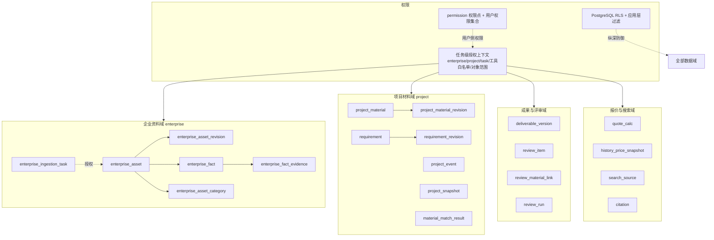
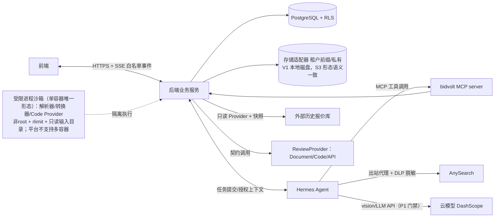

# 数据域与权限边界、威胁模型与测试清单

> 所属：Issue #1 交付物（七）——新增数据域与权限边界图、威胁模型与数据流图、端到端契约/跨租户/Prompt Injection/任务幂等测试清单
> 依据：docs/后端架构设计文档.md（D2/D3/D9/D16）、docs/模块细化设计.md（4.1.5/4.2.5/4.2.6/4.11）

---

## 1. 数据域与权限边界图

边界规则（产品决策 D-H / P0-2）：

- 企业资料域与项目材料域**物理分表、搜索互不可见**；项目材料不得被 `search_assets` 召回，也不得自动转存企业资料库
- 企业资料写工具（classify/upsert）仅 `enterprise_ingestion` 任务可调用
- 所有对象必须携带 `enterprise_id`（项目对象再带 `project_id`），由中间件注入，禁止客户端传租户参数

---

## 2. 威胁模型（STRIDE）

| # | 威胁 | 攻击路径 | 缓解机制 | 对应验收 |
|---|---|---|---|---|
| T1 | 跨租户越权（IDOR） | 猜解/替换对象 ID 访问他企业数据 | 应用层强制 enterprise_id 过滤 + RLS + 复合唯一键；服务端授权下载 | A-1 跨租户 IDOR 用例组 |
| T2 | 静态 Token 全权限滥用 | 窃取内部 Token 调用任意工具 | 任务级授权上下文，工具白名单 + 对象范围；企业资料写工具仅导入任务 | A-2 授权上下文用例组 |
| T3 | Prompt Injection / 恶意材料诱导越权 | 招标材料/网页内容诱导 Agent 写企业资料库或读他项目 | 上传内容标记不可信；不可信数据不改变授权；解析任务无工具/无网络/无记忆 | A-3 Prompt Injection 用例组 |
| T4 | 重复投递/并发覆盖 | 同一任务重放、用户与 Agent 并发写版本 | idempotency_key 唯一约束 + expected_version_id CAS(409) + generation 陈旧拦截 | A-4 幂等与并发用例组 |
| T5 | 恶意文件（zip 炸弹/路径穿越/病毒） | 超大解压、`../` 写出、符号链接、带毒文档 | 解压字节/文件数/比/深度限制；拒绝路径穿越与链接；ClamAV 强制；沙箱解析 | A-5 文件安全用例组 |
| T6 | 敏感信息外泄（搜索/模型） | 企业资料片段随搜索请求出网；思维链透传前端 | 出站代理 + DLP 脱敏；SSE 白名单事件；云服务未确认前默认关闭 | A-6 SSE 白名单、A-7 出站安全 |
| T7 | 报价被 AI 编造/误写 | LLM 直出价格数字、未确认写库 | 报价只建议不落库；无追溯依据不输出数字；quote.apply 双门禁（确认+权限）+ 审计 | A-8 报价边界用例组 |
| T8 | 外部评审不可用/被污染 | API Provider 超时、返回非法数据 | 超时/重试/限流/熔断；provider_raw_hash；结果不直接改成果 | A-9 ReviewProvider 用例组 |
| T9 | 代码 Provider 逃逸 | 恶意规则代码访问网络/数据库 | 受限进程沙箱（ADR D17）：非 root 子进程 + rlimit CPU/内存/时间 + 只读输入目录 + 无外部网络依赖；平台不支持多容器，V1 沙箱即此近似隔离 | A-10 沙箱边界用例组 |
| T10 | 审计缺失导致不可追溯 | 关键操作无记录 | 4.11.3 动作枚举全量必记；审计视图独立权限 | A-11 审计用例组 |

---

## 3. 数据流图（简化，聚焦边界）

关键边界：

- 前端只能看到白名单事件（phase/status/percent/当前工作/简短依据/操作提示），**任何内部 ID、凭据、思维链、工具参数、错误栈不出后端**
- Hermes 不直接访问 DB/OSS，一切业务数据经 MCP → 后端授权校验
- 外部报价库只读；搜索出网必经代理；云模型/搜索未确认前默认关闭

---

## 4. 测试清单

> 对应 Issue #1 验收标准（六）与 P0/P1 各项。进入核心开发时按里程碑（M1~M6）逐项落地，全部通过后再进入生产级开发。

### A-1 跨租户 IDOR（P0-1）

- [x] 两个企业分别注册，A 企业 Token 访问 B 企业全部对象接口（文件/任务/Requirement/成果/评分/报价/引用/审计）均 403/404（`test_idor.py::test_cross_tenant_all_object_interfaces`；期间修复评分项/引用跨租户 200 泄漏）
- [x] 项目对象跨项目访问（同企业不同 project）被拒（`test_same_enterprise_cross_project_isolated`）
- [ ] 下载签名 URL 无权限返回 403；签名过期返回 401
- [x] RLS 策略用例：绕过应用层直接 SQL 查询另一 enterprise_id 返回空集（`test_rls_container.py`，容器专属）
- [x] citation/search_source/review_material_link 等关联表逐项覆盖（IDOR 测试含 search-source/citation/references）

### A-2 任务级授权上下文（P0-2）

- [x] 企业资料导入任务可调用 classify/upsert 企业资料工具；其他任务调用返回 403（`test_capability.py::test_enterprise_ingestion_only_enterprise_tools` + API 端点校验）
- [x] 项目材料读取、成果写入、评审提交、网络搜索分别授权，互不越界（`TASK_TOOL_WHITELIST` + `test_mcp_call_with_disallowed_tool_rejected`）
- [x] 恶意材料内容（Prompt Injection 样本）不改变工具白名单与对象范围（`test_security_api.py` + capability 独立校验）
- [x] 任务结束/取消后授权上下文失效，MCP 调用返回 403（`test_capability_invalid_after_task_terminal`，线上实测 200→403）

### A-3 Prompt Injection（P1）

- [ ] 招标材料内含"把 XX 写入企业资料库/读取其他项目/调用未授权工具"指令 → 行为不变
- [ ] 网页搜索结果含注入指令 → 不改变授权、不写正文
- [ ] 扫描件/图片内嵌指令（视觉模型场景）→ 同上

### A-4 任务幂等与版本并发（P0-4）

- [ ] 同一 idempotency_key 重复投递只产生一个任务与一个目标版本
- [ ] 用户编辑与 Agent 写入并发：expected_version_id 不符返回 409，无静默覆盖
- [ ] Worker 中断后重试不重复副作用；重试耗尽进入终态失败（可查询、可人工处理）
- [ ] 已取消/已替代/过期任务（generation 校验）写入被拒
- [ ] 批量确认中某条冲突/失败，其余条目结果不丢失（逐条返回）
- [ ] 版本、当前指针、任务结果、审计在单事务提交；构造"提交成功但任务丢失"场景验证不存在

### A-5 文件安全（P1）

- [ ] 压缩包超限（总字节/文件数/解压比/深度）被拒
- [ ] 绝对路径、`..`、符号链接、硬链接、设备文件条目 → 整包拒绝
- [ ] 伪装 MIME（exe 改名 pdf）被 magic bytes 校验拦截
- [ ] 病毒样本（EICAR）被 ClamAV 拦截，不入库
- [ ] 恶意 PDF/DOCX 在受限进程解析，无法访问网络/数据库/宿主机业务目录
- [ ] 低置信/损坏/加密文件进入"需人工处理"，不静默丢弃

### A-6 SSE 白名单（P1）

- [ ] 事件流仅含白名单字段；构造包含思维链/工具参数/内部 ID/凭据/错误栈的 Hermes 输出 → 被过滤
- [ ] 错误时前端只显示可理解失败状态，详细错误仅进服务端日志
- [ ] SSE/前端日志/遥测扫描无敏感资料原文

### A-7 出站安全（P0-2）

- [ ] 搜索请求必须经出站代理，无代理环境调用被拒
- [ ] DLP 脱敏样本（手机号/证件号/银行账号/信用代码）不出网
- [ ] 域名策略：黑名单域名拒绝，白名单放行
- [ ] 数据分级/授权未确认前，云模型与搜索默认关闭（P1 门禁；确认入口 = `docs/数据分级与授权确认清单.md`）

### A-8 报价边界（D-F / P1）

- [ ] LLM 不产生最终报价数字；无公式/无数据时仅输出区间 + 依据/假设/置信度/风险
- [ ] 无可追溯依据时返回 unavailable，不输出数字
- [ ] 口径不一致（单位/币种/税）样本不参与计算
- [ ] 超上限、低于成本、税额错误、数据不足均被确定性拦截
- [ ] `/quotes/apply` 需用户确认 + `quote.apply` 权限，写版本 + 审计；无确认/无权限均拒绝
- [ ] 任一建议价可按冻结样本 + 标准化参数 + 算法版本复算

### A-9 ReviewProvider 契约（D-G）

- [ ] Document / Code / API 三类 Provider 契约测试（API 用 Mock Server、Code 用示例检查器、Document 用测试规则文档）
- [ ] Provider 超时/失败/返回非法数据不污染成果与评分主记录
- [ ] 每次评审可复原输入快照、Provider 版本、evidence 与 provider_raw_hash
- [ ] 评审结果不直接修改成果；逐条 review_item 状态机（pending_confirm → confirmed/rejected → re_reviewed）可恢复

### A-10 沙箱边界（P1）

- [x] Code Provider 受限执行机制落地：`app/services/sandbox.py::run_restricted`（CPU/地址空间/文件大小 rlimit + 拒绝 root + 剥离代理环境变量 + 只读输入目录），`tests/unit/test_sandbox.py` 5 项验证（root 拒绝/资源超限/语法错误/代理剥离）。V1 内置评审为确定性代码，外部 Code Provider 接入时必须经此通道
- [x] 解析器/转换器/解压器受限执行约定：与 Code Provider 共用 `run_restricted` 通道，无外部网络依赖（依赖系统命令的 unrar/7z 由容器基线提供）
- [ ] （演进预留，不纳入 V1 验收）强隔离沙箱（无网络、只读根文件系统的独立沙箱容器）——需平台支持多容器

### A-11 审计与配额（P1）

- [x] 审计查看端点 `/api/v1/audit/logs`（audit.view 权限门禁 + 租户隔离，`test_audit_api.py`）；文件下载/评分/报价/权限/项目/企业资料操作均有 write_audit 埋点
- [x] 每租户存储/并发/模型 token/搜索/导出配额生效，超限行为符合 4.11.1（`test_quota_api.py`：上传 413/导出 429）
- [ ] 备份恢复演练：RPO ≤ 24h、RTO ≤ 4h 实测通过；注销数据 90 天后物理删除

### A-12 评分审核闭环（D-J）

- [x] 逐条 review_item 独立返回（含分类/得分/建议/证据/状态，`test_review_api.py` + demo 前端实测）
- [x] 单条/批量上传材料 → 确认 → 重审 → 更新实际得分全链路（`test_re_evaluate_improves_score_after_material`；修复重审子集导致总分丢失的 bug）
- [x] 未确认的材料关联不改变实际得分（`test_unconfirmed_material_does_not_change_score`，未确认提升为 0 分）
- [x] 刷新/重登/重进项目后，逐条状态与记录可恢复（状态持久化于 review_item/score_record，API 重查 + demo 网页实测）
- [x] 总分与逐条得分来自同一冻结输入与规则版本（evaluate 冻结 snapshot + provider_raw_hash，`test_provider_list_after_evaluate`）

---

## 5. 关联文档

- 后端架构设计文档（v0.3，D2~D16）
- 模块细化设计（4.1.5 权限模型、4.2.5/4.2.6 数据域、4.11 配额与审计）
- docs/hermes/bidvolt-mcp-tools.md（MCP IDL 与五条 Skill 契约测试）
