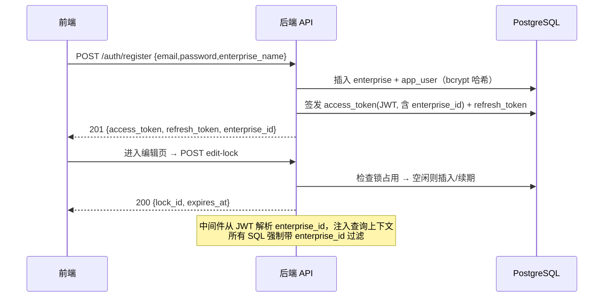
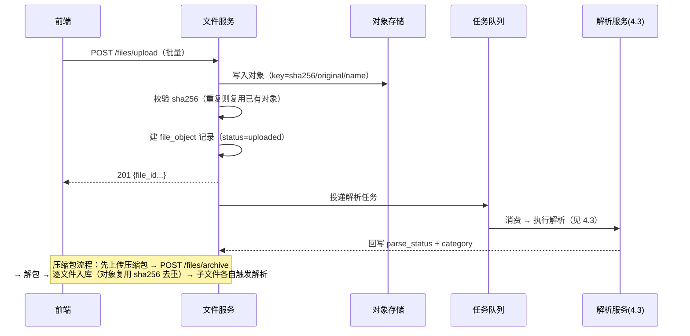
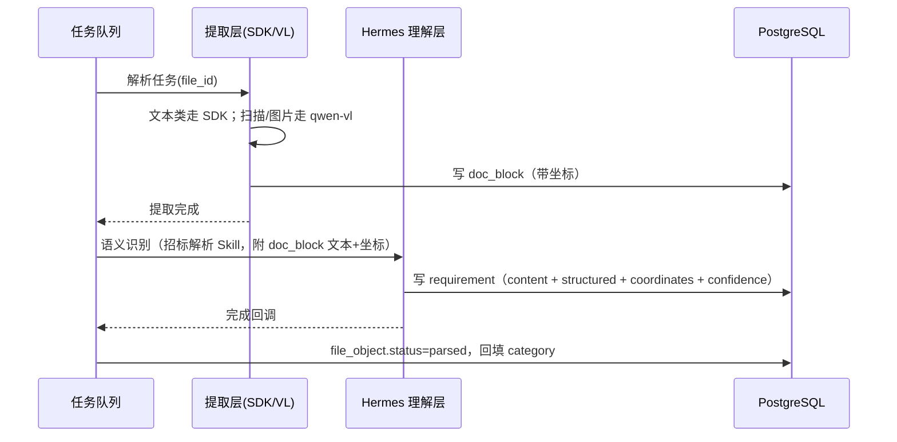
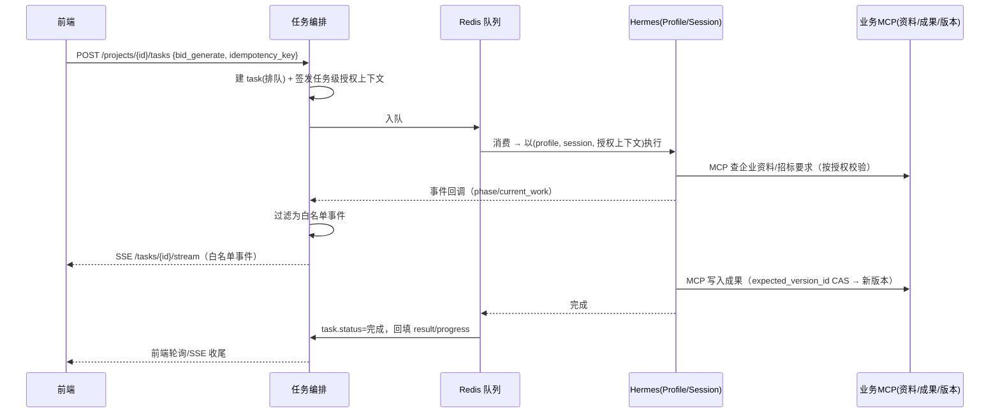
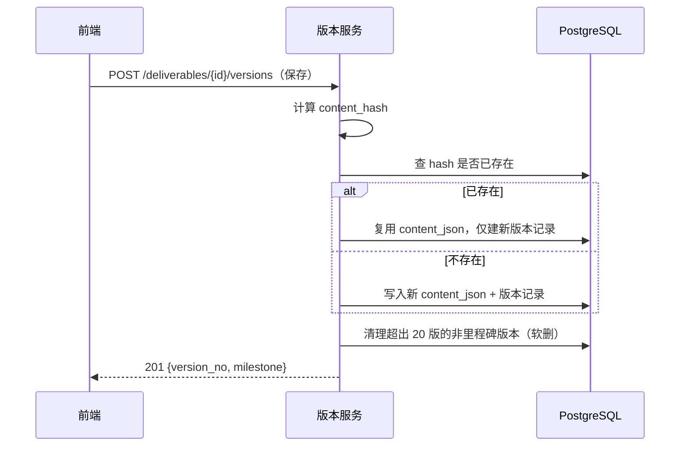
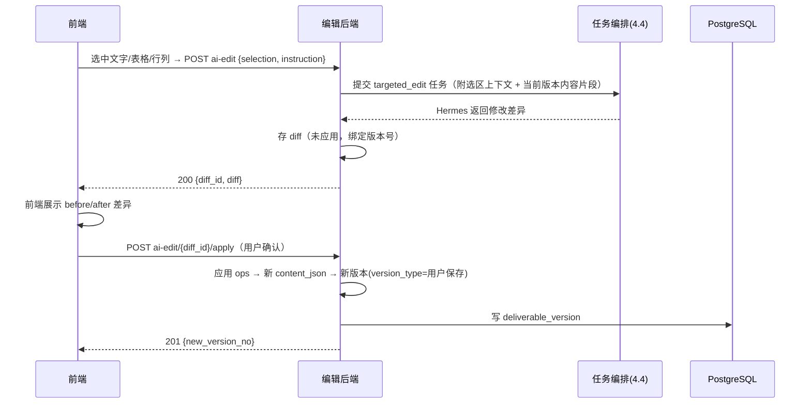
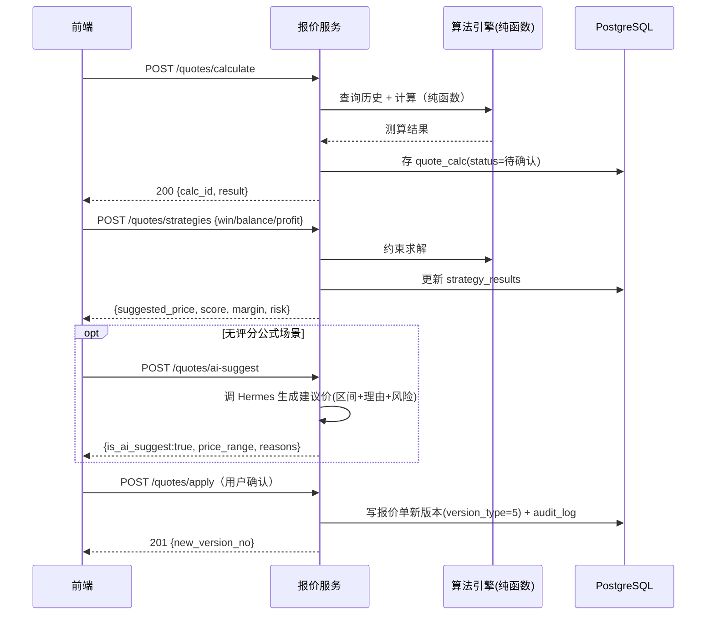
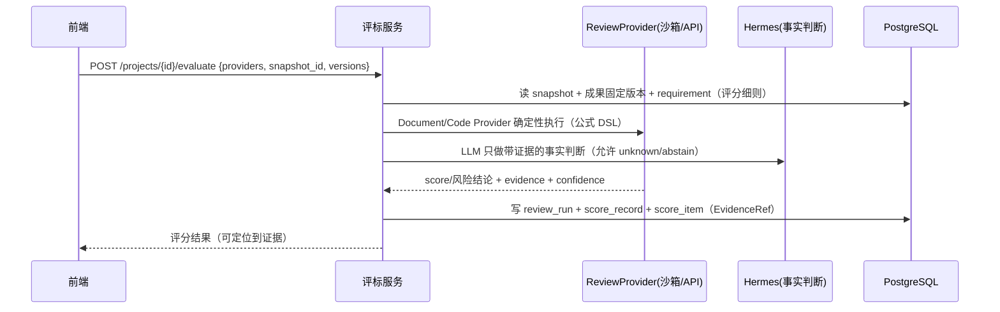
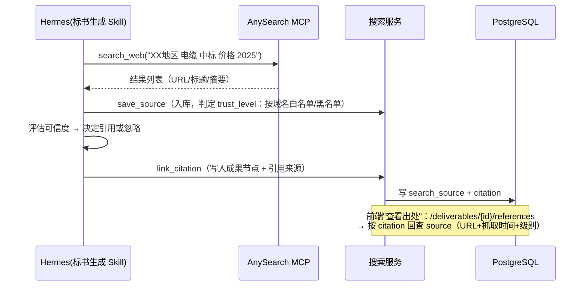
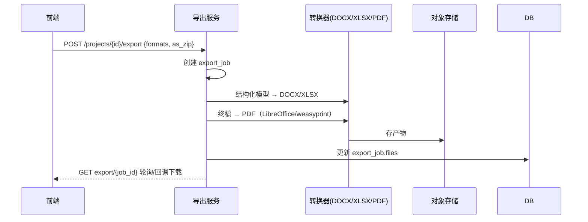

# 《AI电投助手》后端模块细化设计

> 基于《后端架构设计文档》v0.2（已按 Issue #1 产品决策修订），对 4.1~4.10 各模块逐一细化
> 每个模块输出：接口契约（REST API）、数据表 DDL、核心流程时序、依赖与风险
> 技术栈：后端 **Python 3.11+ / FastAPI / PostgreSQL 15+（含 RLS）/ Redis / S3 兼容对象存储**（与 Hermes 及解析 SDK 生态一致）。接口契约与 DDL 以 PostgreSQL 为准。
> 部署说明（架构决策）：应用与 PG 均为 Docker 容器部署（官方 postgres:16 镜像，数据卷挂宿主机路径持久化，每日 pg_dump 备份）；数据库独立容器，不与应用容器同容器裸跑。

---

## 4.1 认证与数据隔离

### 4.1.1 接口契约

统一前缀 `/api/v1`，认证接口除外均需携带 `Authorization: Bearer <access_token>`。

| 方法 | 路径 | 说明 | 请求 | 响应 |
|---|---|---|---|---|
| POST | /auth/register | 注册（免邮件验证） | `{email, password, enterprise_name}` | 201 `{user_id, enterprise_id, access_token, refresh_token}` |
| POST | /auth/login | 登录 | `{email, password}` | 200 同上；失败 401 |
| POST | /auth/logout | 登出 | - | 204 |
| GET | /auth/me | 当前用户信息 | - | `{user_id, email, enterprise_id, enterprise_name}` |
| POST | /auth/refresh | 刷新令牌 | `{refresh_token}` | 200 `{access_token, refresh_token}` |
| POST | /projects/{project_id}/edit-lock | 获取项目编辑锁 | - | 200 `{lock_id, expires_at}`；409 已被占用 `{holder, expires_at}` |
| PUT | /projects/{project_id}/edit-lock/heartbeat | 锁心跳续期 | - | 200 `{expires_at}` |
| DELETE | /projects/{project_id}/edit-lock | 释放锁 | - | 204 |

规则：
- 注册即创建企业（一账号一企业），返回 `enterprise_id`，后续所有请求的租户上下文由 token 解析，客户端不需要传 `enterprise_id`
- 编辑锁：进入编辑页获取锁，保存/离开释放，心跳默认 30s，超时 2min 自动释放；同一企业内同一项目仅一个编辑会话
- 密码强度：≥8 位且含字母数字；密码 bcrypt 哈希（cost=12）
- **租户隔离（产品决策 D-A）**：应用层强制过滤（中间件注入 `enterprise_id`）+ 核心租户表 **RLS**（`FORCE ROW LEVEL SECURITY`）+ `(enterprise_id, id)` 复合唯一键 / 同租户复合外键；对象存储租户前缀 + 私有桶 + 签名 URL

### 4.1.2 数据表 DDL（PostgreSQL + RLS 示例）

```sql
-- 启用 RLS 示例（enterprise/app_user 等核心表）
ALTER TABLE app_user ENABLE ROW LEVEL SECURITY;
ALTER TABLE app_user FORCE ROW LEVEL SECURITY;
CREATE POLICY app_user_tenant_isolation ON app_user
    USING (enterprise_id = current_setting('app.enterprise_id')::bigint);
-- 应用层在连接建立时 SET app.enterprise_id = <当前企业>（由中间件执行）
```

```sql
CREATE TABLE enterprise (
    id              BIGSERIAL PRIMARY KEY,
    name            VARCHAR(200) NOT NULL,
    credit_code     VARCHAR(50),                -- 统一社会信用代码，可后补
    created_at      TIMESTAMPTZ NOT NULL DEFAULT now(),
    updated_at      TIMESTAMPTZ NOT NULL DEFAULT now()
);

CREATE TABLE app_user (
    id              BIGSERIAL PRIMARY KEY,
    enterprise_id   BIGINT NOT NULL REFERENCES enterprise(id),
    email           VARCHAR(255) NOT NULL UNIQUE,
    password_hash   VARCHAR(255) NOT NULL,       -- bcrypt
    status          SMALLINT NOT NULL DEFAULT 1, -- 1 正常 0 禁用
    created_at      TIMESTAMPTZ NOT NULL DEFAULT now()
);

CREATE TABLE refresh_token (
    id              BIGSERIAL PRIMARY KEY,
    user_id         BIGINT NOT NULL REFERENCES app_user(id),
    token_hash      VARCHAR(255) NOT NULL UNIQUE, -- 存哈希，不存明文
    expires_at      TIMESTAMPTZ NOT NULL,
    revoked         BOOLEAN NOT NULL DEFAULT FALSE,
    created_at      TIMESTAMPTZ NOT NULL DEFAULT now()
);

CREATE TABLE project_edit_lock (
    project_id      BIGINT PRIMARY KEY,          -- 与 project 表关联（见 4.1 里程碑 M1）
    lock_token      VARCHAR(64) NOT NULL,
    holder_user_id  BIGINT NOT NULL,
    acquired_at     TIMESTAMPTZ NOT NULL DEFAULT now(),
    expires_at      TIMESTAMPTZ NOT NULL
);
```

### 4.1.3 核心流程时序



### 4.1.4 依赖与风险

| 项 | 说明 |
|---|---|
| 依赖 | PostgreSQL、JWT 库（python-jose）、bcrypt；编辑锁依赖 Redis 可选（表实现简单但需清理过期锁的后台任务） |
| 风险 1 | JWT 无状态无法即时吊销 → 登出靠 refresh_token 吊销 + access_token 短时效（默认 2h） |
| 风险 2 | 编辑锁超时释放依赖心跳，网络抖动可能导致误释放 → 心跳窗口放宽（30s 心跳 / 2min 超时） |
| 风险 3 | 密码策略与电网客户安全要求可能不一致 → 预留密码复杂度配置项 |

---

## 4.2 文件服务

### 4.2.1 接口契约

| 方法 | 路径 | 说明 | 请求 | 响应 |
|---|---|---|---|---|
| POST | /files/upload | 上传文件（批量/拖拽） | `multipart/form-data`：`files[]`、`target`(enterprise/project)、`project_id?` | 201 每文件 `{file_id, name, size, mime, status}` |
| POST | /files/archive | 压缩包解包导入 | `{archive_file_id, target, project_id?}` | 202 `{job_id}` |
| GET | /files/{file_id}/download | 下载原始文件 | - | 200 文件流 |
| GET | /files/{file_id}/info | 文件元信息 | - | `{file_id, name, sha256, size, mime, status, parse_status, category}` |
| GET | /files | 文件列表 | `?target=&project_id=&page=&size=` | 分页列表 |
| DELETE | /files/{file_id} | 删除（仅逻辑删除） | - | 204 |

要点：
- 上传大小限制：单文件默认 200MB（可配），压缩包解包后文件数上限 1000、解压比上限 100:1（zip 炸弹防护）
- 文件归属：`target=enterprise` 存入企业资料域（跨项目复用）；`target=project` 存入项目材料域（仅本项目）。**归属由上传入口确定，无"同时存入企业资料库"选项**（产品决策 D-H；项目材料即便包含企业信息也不转存）
- 上传成功返回后，异步触发解析（见 4.3），`status` 流转：`uploaded → parsing → parsed / parse_failed`

### 4.2.2 数据表 DDL

```sql
CREATE TABLE file_object (
    id              BIGSERIAL PRIMARY KEY,
    enterprise_id   BIGINT NOT NULL REFERENCES enterprise(id),
    project_id      BIGINT,                      -- 归属项目（当前招标材料）；空 = 企业资料库
    owner_type      SMALLINT NOT NULL,           -- 1 企业资料 2 当前招标材料
    bucket          VARCHAR(100) NOT NULL,       -- 对象存储桶
    object_key      VARCHAR(500) NOT NULL,       -- 不可变 key：{sha256}/original/{name}
    sha256          CHAR(64) NOT NULL,
    original_name   VARCHAR(500) NOT NULL,
    size_bytes      BIGINT NOT NULL,
    mime_type       VARCHAR(100),
    ext             VARCHAR(20),
    category        VARCHAR(50),                 -- 分类（见 4.3 理解层识别结果回填）
    status          SMALLINT NOT NULL DEFAULT 1, -- 1 已上传 2 解析中 3 已解析 4 解析失败 5 需人工处理
    parse_status    JSONB,                       -- {error_code, message, low_confidence_files:[]}
    is_deleted      BOOLEAN NOT NULL DEFAULT FALSE,
    created_at      TIMESTAMPTZ NOT NULL DEFAULT now()
);
CREATE INDEX idx_file_owner ON file_object(enterprise_id, owner_type, project_id);

CREATE TABLE archive_job (
    id              BIGSERIAL PRIMARY KEY,
    enterprise_id   BIGINT NOT NULL,
    archive_file_id BIGINT NOT NULL REFERENCES file_object(id),
    status          SMALLINT NOT NULL DEFAULT 1, -- 1 解包中 2 完成 3 部分失败 4 失败
    result          JSONB,                       -- {imported:[file_id...], failed:[{name,reason}]}
    created_at      TIMESTAMPTZ NOT NULL DEFAULT now()
);
```

### 4.2.3 核心流程时序



### 4.2.4 依赖与风险

| 项 | 说明 |
|---|---|
| 依赖 | S3 兼容对象存储（MinIO/云 OSS）、Redis 任务队列、解压库（pyzipper/patool）、病毒扫描（ClamAV，可选） |
| 风险 1 | 大文件上传超时 → 前端分片 + 后端分片合并（v2 再实现，v1 单请求限 200MB） |
| 风险 2 | RAR/7Z 解包库在服务端可用性 → 用 patool 依赖系统解压命令，需容器内置 |
| 风险 3 | 重复文件：同名同 sha256 去重策略需产品确认（"新旧版本"识别依赖此，见说明书企业资料库） |
| 风险 4 | 压缩包内嵌套压缩包 → 限制嵌套深度 ≤3 |

## 4.3 文档解析与坐标定位

### 4.3.1 解析管道总览

```
file_object.status = uploaded
        │  触发（任务队列）
        ▼
┌─ 解析调度（按 mime/ext 路由）─────────────────────┐
│  文本类（有文本层）          无文本层（图片/扫描）     │
│  PDF→PyMuPDF  DOCX→python-docx   │  图片/扫描PDF/内嵌图  │
│  XLSX→openpyxl  OFD→OFDRW       │  → Hermes vision_model │
│  TXT→直接读取                    │    （qwen-vl 云 API）   │
└──────────────┬──────────────────┴──────────┬──────────┘
               ▼                              ▼
     doc_block 结构化文本块（带坐标）    doc_block（VL 输出文本 + 语义标注）
               ▼
┌─ 理解层（Hermes + 招标解析 Skill）─────────────┐
│  判断文件类型 → 抽取 Requirement 字段             │
│  每条抽取结果绑定 doc_block 坐标                 │
└──────────────────────────────────────────────┘
```

### 4.3.2 接口契约

| 方法 | 路径 | 说明 |
|---|---|---|
| GET | /files/{file_id}/parse-status | 解析状态与结果：`{status, category, blocks_count, error}` |
| GET | /files/{file_id}/blocks | 分页读取结构化文本块（带坐标），供前端预览定位 |
| GET | /requirements/{req_id} | 招标解析结果详情（含定位坐标列表） |

解析本身为异步内部任务，不暴露同步触发接口；上传/解包后自动入队。

### 4.3.3 数据表 DDL

```sql
CREATE TABLE doc_block (
    id              BIGSERIAL PRIMARY KEY,
    file_id         BIGINT NOT NULL REFERENCES file_object(id),
    block_type      VARCHAR(20) NOT NULL,  -- paragraph / table / cell / image / title
    page_no         INT,                   -- 页码（从 1 起；无页码场景为 NULL）
    block_index     INT NOT NULL,          -- 块内序号（段落/表格/单元格定位）
    parent_block_id BIGINT,                -- 单元格所属表格块
    text_content    TEXT,
    extra           JSONB,                 -- {table_cols, table_rows, image_url, conf} 等
    created_at      TIMESTAMPTZ NOT NULL DEFAULT now()
);
CREATE INDEX idx_docblock_file ON doc_block(file_id, page_no, block_index);

CREATE TABLE requirement (
    id              BIGSERIAL PRIMARY KEY,
    enterprise_id   BIGINT NOT NULL,
    project_id      BIGINT NOT NULL,
    req_type        VARCHAR(50) NOT NULL,  -- basic_info/qualification/score_rule/reject_clause/tech_requirement/quote_rule/material_checklist/attachment
    content         TEXT NOT NULL,         -- 解析出的要求文本
    structured      JSONB,                 -- 结构化字段（如评分办法公式、资格项列表）
    source_file_id  BIGINT REFERENCES file_object(id),
    coordinates     JSONB,                 -- [{file_id,page_no,block_index,...}] 定位锚点
    confidence      NUMERIC(4,3),          -- 识别置信度
    created_at      TIMESTAMPTZ NOT NULL DEFAULT now()
);
CREATE INDEX idx_req_project ON requirement(project_id, req_type);
```

### 4.3.4 核心流程时序



### 4.3.5 依赖与风险

| 项 | 说明 |
|---|---|
| 依赖 | PyMuPDF、python-docx、openpyxl、OFDRW、qwen-vl 云 API（DashScope）、Hermes |
| 风险 1 | OFDRW 对版式复杂 OFD 支持有限 → 先用文本层，扫描版走 qwen-vl；上线前用真实样本验收 |
| 风险 2 | 坐标漂移：成果经 AI/用户修改后，requirement 坐标指向旧内容 → 坐标只保证"原文定位"，不做跨版本对齐（记录 source 版本） |
| 风险 3 | qwen-vl 成本与限流 → 仅无文本层内容才调；做每日配额与重试退避 |
| 风险 4 | 低置信度识别（说明书要求提示用户）→ confidence<0.7 时 status=需人工处理，前端提示确认 |

---

## 4.4 Hermes Agent 集成

### 4.4.1 部署形态与配置

- 独立容器运行 Hermes Agent；后端以 **Python 库嵌入**为主接入（主进程内嵌或在同一网络内以 API Server 方式），两者对业务透明
- 配置（示例）：

```yaml
# hermes config.yaml（核心项）
providers:
  default: deepseek           # 主推理 provider
  dashscope: {}               # 视觉模型 provider（qwen-vl）
models:
  main: deepseek-v4-flash     # 主推理
  vision: qwen-vl-max        # vision_model：扫描件/图片理解
  cheap: deepseek-v4-flash   # 轻量任务（分类/摘要）
mcp_servers:
  bidvolt:                    # 业务服务能力
    command: python
    args: ["-m", "bidvolt_mcp"]
  anysearch:                  # 搜索（key 从 .env 读取）
    command: python
    args: ["-m", "anysearch_mcp"]
skills:
  enabled: [tender_parse, material_match, bid_generate, mock_evaluate, targeted_edit]
```

- `.env` 关键项：`DASHSCOPE_API_KEY`、`ANYSEARCH_KEY`（缺省则降级匿名）、各 provider 密钥
- **深化设计**：业务 MCP 工具契约与 5 个 SKILL.md 草稿见 `docs/hermes/`（README 为总览），Skill 目录结构按 Hermes 官方格式，可直接部署到 Hermes skills 目录

### 4.4.2 隔离模型（产品决策 D-B）

- **Profile = 企业**：每企业一个 Hermes profile，隔离 MEMORY 与技能沉淀（**业务上下文**，非安全边界）
- **Session = 项目**：每项目一个 session，隔离对话上下文（**业务上下文**，非安全边界）
- **任务级授权上下文（安全边界）**：每个任务签发授权上下文，绑定 `(enterprise_id, project_id, task_id, 工具白名单, 对象范围)`；Hermes 调 MCP 工具时后端按授权上下文校验，禁止静态 Token 全权限
- 后端任务编排维护映射：`(enterprise_id, project_id) → (profile, session)`，并向 MCP 会话注入授权上下文

### 4.4.3 任务编排接口与表

| 方法 | 路径 | 说明 |
|---|---|---|
| POST | /projects/{project_id}/tasks | 提交任务：`{task_type, payload, idempotency_key}`，task_type ∈ `tender_parse / material_match / bid_generate / bid_review / mock_evaluate / targeted_edit / chat` |
| GET | /tasks/{task_id} | 任务状态与结果 |
| GET | /tasks/{task_id}/stream | SSE 事件流（**白名单事件**，产品决策 D-E） |
| POST | /projects/{project_id}/tasks/{task_id}/interrupt | 补充材料后的插队重规划（可选） |
| POST | /projects/{project_id}/chat | 底部对话：`{message, selection?}`，返回白名单事件流 |

```sql
CREATE TABLE task (
    id                BIGSERIAL PRIMARY KEY,
    enterprise_id     BIGINT NOT NULL,
    project_id        BIGINT NOT NULL,
    task_type         VARCHAR(50) NOT NULL,
    idempotency_key   VARCHAR(100) NOT NULL,      -- 幂等（产品决策 D-C）
    priority          SMALLINT NOT NULL DEFAULT 5, -- 补充材料插队任务 = 1
    status            SMALLINT NOT NULL DEFAULT 1, -- 1 排队 2 执行中 3 完成 4 失败(可重试) 5 已取消 6 终态失败(重试耗尽)
    payload           JSONB NOT NULL,
    result            JSONB,                       -- 完成结果（含文档写入请求）
    progress          JSONB,                       -- {phase, status, percent, current_work}（白名单）
    retry_count       SMALLINT NOT NULL DEFAULT 0,
    generation        INT NOT NULL DEFAULT 1,      -- 陈旧写入拦截（产品决策 D-C）
    error             JSONB,
    created_at        TIMESTAMPTZ NOT NULL DEFAULT now(),
    finished_at       TIMESTAMPTZ,
    UNIQUE (idempotency_key, enterprise_id)        -- 防重复投递
);
CREATE INDEX idx_task_queue ON task(priority, id) WHERE status = 1; -- 队列消费
```

**SSE 白名单事件（产品决策 D-E）**：
```jsonc
// 允许推送的字段（禁止思维链/工具参数/返回值/内部ID/凭据/错误栈）
{ "phase": "generate", "status": "running", "percent": 40,
  "current_work": "正在生成技术标", "summary": "技术标已完成商务响应章节", "hint": null }
```

### 4.4.4 核心流程时序（开始生成）



### 4.4.5 依赖与风险

| 项 | 说明 |
|---|---|
| 依赖 | Hermes Agent（开源）、Redis、DASHSCOPE_API_KEY、业务 MCP server（bidvolt_mcp，见 4.5/4.7 工具面） |
| 风险 1 | 长任务失败/进程重启 → task 有 retry_count 与断点恢复（Hermes checkpoints），重试耗尽进入终态失败（可人工处理） |
| 风险 2 | Profile/Session 映射持久化 → 用 enterprise_id+project_id 作为稳定 key，重启后重建 session 引用旧会话 |
| 风险 3 | 重复投递 → idempotency_key 唯一约束，重复请求返回原 task_id |
| 风险 4 | 陈旧写入 → generation 校验，已取消/已替代/过期任务写入返回 409 |
| 风险 5 | 模型成本失控 → 主推理/轻量任务走 deepseek-v4-flash，LLM 调用计费接入统计面板 |
| 风险 6 | 插队重规划与执行中任务的一致性 → v1 实现为：执行中任务允许追加指令消息（Hermes 同 session 注入），不强制取消任务 |

## 4.5 文档结构化模型与版本

### 4.5.1 结构化模型定义

- 商务标/技术标：`DocModel` JSON —— 段落、标题、表格、图片节点的有序数组（docx 解析产物）
- 报价单：`SheetModel` JSON —— 工作表、行列、单元格（值/公式/样式）结构（xlsx 解析产物）
- 与前端约定统一 JSON Schema（见 4.6 差异协议），前端在线编辑与后端存储共用同一模型

```jsonc
// DocModel 示例（简化）
{
  "type": "doc",
  "nodes": [
    {"id": "n1", "type": "heading", "level": 1, "text": "第一章 商务响应"},
    {"id": "n2", "type": "paragraph", "text": "……", "style": {"align": "left"}},
    {"id": "n3", "type": "table", "rows": 3, "cols": 2,
     "cells": [["企业名称", "XX电力设备有限公司"], …]},
    {"id": "n4", "type": "image", "url": "…", "caption": "营业执照"}
  ]
}
```

### 4.5.2 接口契约

| 方法 | 路径 | 说明 |
|---|---|---|
| GET | /deliverables | 项目成果列表（商务标/技术标/报价单，含当前版本号、页数、字数、评分） |
| GET | /deliverables/{id}/versions | 版本列表（版本号、类型、时间、创建人、是否里程碑） |
| GET | /deliverables/{id}/versions/{version_no} | 读取指定版本内容 |
| POST | /deliverables/{id}/versions | 保存新版本（见 4.6 保存流程） |
| POST | /deliverables/{id}/restore/{version_no} | 恢复指定版本为新当前版本 |
| GET | /deliverables/{id}/diff?from=&to= | 两个版本差异（节点级 diff） |

### 4.5.3 数据表 DDL

```sql
CREATE TABLE deliverable (
    id              BIGSERIAL PRIMARY KEY,
    enterprise_id   BIGINT NOT NULL,
    project_id      BIGINT NOT NULL,
    deliverable_type SMALLINT NOT NULL,      -- 1 商务标 2 技术标 3 报价单
    title           VARCHAR(200) NOT NULL,
    current_version_no INT NOT NULL DEFAULT 1,
    stat            JSONB,                   -- {pages, words, score, improvable, missing_files}
    created_at      TIMESTAMPTZ NOT NULL DEFAULT now(),
    updated_at      TIMESTAMPTZ NOT NULL DEFAULT now()
);
CREATE UNIQUE INDEX idx_deliverable_uniq ON deliverable(project_id, deliverable_type);

CREATE TABLE deliverable_version (
    id              BIGSERIAL PRIMARY KEY,
    deliverable_id  BIGINT NOT NULL REFERENCES deliverable(id),
    version_no      INT NOT NULL,
    version_type    SMALLINT NOT NULL,       -- 1 原始上传 2 AI生成 3 AI校核 4 用户保存 5 报价应用
    milestone       BOOLEAN NOT NULL DEFAULT FALSE,  -- 里程碑永久保留
    content_json    JSONB NOT NULL,          -- DocModel / SheetModel
    content_hash    CHAR(64) NOT NULL,       -- sha256，去重用
    created_by      BIGINT,
    source_task_id  BIGINT,                  -- 来源任务（AI 修改时）
    created_at      TIMESTAMPTZ NOT NULL DEFAULT now(),
    UNIQUE (deliverable_id, version_no)
);
CREATE INDEX idx_dv_hash ON deliverable_version(content_hash);
```

### 4.5.4 版本保留与去重规则

- 保留：非里程碑版本仅保留**最近 20 版**（按版本号倒序），超出即软删（`is_deleted` 标记，可配置保留数）
- 里程碑（永久）：`version_type ∈ {1 原始上传, 2 AI生成, 3 AI校核}` 且用户手动保存标记的版本
- 去重：写入时计算 `content_hash`，与既有版本相同则复用同一 `content_json`（不重复落盘），`content_hash` 加索引

### 4.5.5 核心流程时序



### 4.5.6 依赖与风险

| 项 | 说明 |
|---|---|
| 依赖 | PostgreSQL JSONB、版本清理后台任务 |
| 风险 1 | 大 JSON（几百页标书）写入/读取性能 → 单版本 JSON 可能数 MB，加 GZIP 压缩存储（`content_json` 用 bytea 压缩列或压缩 JSONB） |
| 风险 2 | 节点级 diff 计算成本 → v1 用行级/节点 id 对比，大文档分段计算 |
| 风险 3 | 报价单公式引用关系 → SheetModel 需保留公式原文，恢复版本时公式可重算 |

---

## 4.6 在线编辑的后端职责

### 4.6.1 职责边界（后端只做 4 件事）

1. 文档内容服务：读取/保存结构化模型（4.5）
2. 版本服务：保存即新版本（4.5）
3. AI 针对性修改接口：接收"选区 + 指令"，返回修改差异，确认后落版本
4. 导出转换服务：结构化模型 → DOCX/XLSX/PDF（4.10）

### 4.6.2 接口契约

| 方法 | 路径 | 说明 | 请求 | 响应 |
|---|---|---|---|---|
| GET | /deliverables/{id}/content | 当前版本内容（进入编辑页） | - | `{version_no, model}` |
| PUT | /deliverables/{id}/content | 保存（= 新版本） | `{model}` | 201 `{version_no, milestone}` |
| POST | /deliverables/{id}/ai-edit | AI 针对性修改建议 | `{selection, instruction}` selection = `{type: text/table/image/sheet_range, refs:[node_id/cell_range], context}` | 200 `{diff_id, diff}` |
| POST | /deliverables/{id}/ai-edit/{diff_id}/apply | 应用差异（确认后） | - | 201 `{new_version_no}` |
| GET | /deliverables/{id}/ai-edit/{diff_id} | 查看差异详情 | - | `{diff}` |

差异协议（diff 结构，前端展示、确认、应用三方共用）：

```jsonc
// JSON Patch 风格，节点级
{
  "diff_id": "d_xxx",
  "operations": [
    {"op": "replace", "node_id": "n5", "before": {"text": "旧内容"}, "after": {"text": "新内容"}},
    {"op": "insert", "after_node_id": "n8", "node": {"id": "n9", "type": "paragraph", "text": "新增章节"}},
    {"op": "remove", "node_id": "n12"}
  ]
}
```

### 4.6.3 核心流程时序（AI 针对性修改）



### 4.6.4 依赖与风险

| 项 | 说明 |
|---|---|
| 依赖 | 4.4 任务编排、4.5 版本服务、前端编辑器的 diff 渲染能力 |
| 风险 1 | 选区坐标与版本不匹配（用户基于旧版本选中，期间 AI 已改）→ ai-edit 请求必须带 `base_version_no`，后端校验一致才处理 |
| 风险 2 | 差异应用失败（节点已被删除）→ 应用时逐 op 校验节点存在，失败返回冲突列表 |
| 风险 3 | 保存并发：编辑锁（4.1）保证同一项目单会话编辑，后端 PUT content 时校验锁 token |

## 4.7 报价能力（确定性算法 + AI 参考建议分层，产品决策 D-F）

### 4.7.1 模块边界

- **历史报价（外部只读 Provider）**：历史数据源在外部系统，BidVolt 只单向查询（只读权限，生产禁止写）；本地保存本次计算的数据快照（样本值/来源/哈希）用于审计复算，不回写外部库
- **确定性算法服务**（QuoteEngine）：物料标准化、口径统一、异常剔除、单价测算、三类策略——纯 Python 函数模块（`quote/engine.py`），不依赖 LLM，可单元测试
- **AI 参考建议**：Hermes 通过 MCP 调用 QuoteEngine 取确定值；仅无公式/无数据时给出"参考价格区间"（须附依据/假设/置信度/风险，无追溯依据不输出数字）
- **UI 口径**：同时展示"测算价"与"AI 建议价"两个口径（ADR D11），AI 建议明确标注

### 4.7.2 接口契约

| 方法 | 路径 | 说明 | 响应 |
|---|---|---|---|
| GET | /quotes/history | 历史中标查询（外部 Provider 只读）：`?material_name=&material_code=&spec=&tenderer=&region=&year=&page=` | 分页列表 + `{sample_count}` + 快照 |
| GET | /quotes/history/{id} | 物料详情：样本数、最低/最高/中位数/均价/最近中标价、价格趋势、相似样本 | 详情对象 |
| POST | /quotes/calculate | 单价测算：`{material_ref, cost, min_profit_rate, adjustments?}` | `{median, avg_1y, avg_region, avg_spec, adj_time, adj_region, adj_spec, cost, min_profit, cap, score_formula, suggested, sample_count, engine_version}` |
| POST | /quotes/strategies | 三类策略计算：`{calc_id, strategy: win/balance/profit}` | `{suggested_price, score, gross_margin, risk_level, basis}` |
| POST | /quotes/apply | 用户确认应用：`{calc_id/strategy_result_id, expected_version_id, note?}` | 201 `{new_version_no}` + 审计记录 |
| POST | /quotes/ai-suggest | AI 参考价格（仅无公式/无数据）：`{calc_id 或成本信息, instruction}` | `{price_range, recommended, reasons[], assumptions[], confidence, risk_level, is_ai_suggest: true}`；无追溯依据时返回 `{unavailable: true, message}` |

关键规则：
- `/quotes/apply` 是唯一写入门户：校验用户确认标志 → 写入报价单（新版本 version_type=5 报价应用，CAS expected_version_id）→ 写 AuditLog
- `/quotes/ai-suggest` 必须带 `is_ai_suggest: true`、理由、假设、置信度；**无可追溯依据不输出数字**
- 数据不足时允许返回"无法可靠测算/需要补充数据"，不得由 LLM 猜测价格

### 4.7.3 数据表 DDL

```sql
CREATE TABLE history_price_snapshot (             -- 本地快照（外部库不回写）
    id              BIGSERIAL PRIMARY KEY,
    enterprise_id   BIGINT NOT NULL,
    provider_id     VARCHAR(50) NOT NULL,         -- 外部源标识
    material_name   VARCHAR(200) NOT NULL,
    material_code   VARCHAR(100),
    spec            VARCHAR(200),
    region          VARCHAR(100),
    win_price       NUMERIC(18,2) NOT NULL,
    win_date        DATE NOT NULL,
    source_hash     CHAR(64),                     -- 原始样本哈希
    fetched_at      TIMESTAMPTZ NOT NULL DEFAULT now()
);
CREATE INDEX idx_hps_query ON history_price_snapshot(material_name, material_code, region, win_date);

CREATE TABLE quote_calc (
    id              BIGSERIAL PRIMARY KEY,
    enterprise_id   BIGINT NOT NULL,
    project_id      BIGINT NOT NULL,
    params          JSONB NOT NULL,               -- 输入：物料、成本、毛利、调整
    result          JSONB NOT NULL,               -- 测算结果（含 sample_count/engine_version）
    strategy_results JSONB,                       -- {win:{}, balance:{}, profit:{}}
    ai_suggest      JSONB,                        -- {price_range, reasons, assumptions, confidence} 或 {unavailable}
    snapshot_refs   JSONB,                        -- 引用的样本快照 ids + 哈希（可复算）
    status          SMALLINT NOT NULL DEFAULT 1,  -- 1 待确认 2 已应用 3 已放弃
    applied_version_no INT,
    created_at      TIMESTAMPTZ NOT NULL DEFAULT now(),
    applied_at      TIMESTAMPTZ
);

CREATE TABLE audit_log (
    id              BIGSERIAL PRIMARY KEY,
    enterprise_id   BIGINT NOT NULL,
    project_id      BIGINT,
    user_id         BIGINT,
    action          VARCHAR(100) NOT NULL,   -- quote_apply / version_save / ...
    object_type     VARCHAR(50),
    object_id       BIGINT,
    payload         JSONB,                   -- {calc_id, strategy, price, version_no, before, after}
    created_at      TIMESTAMPTZ NOT NULL DEFAULT now()
);
CREATE INDEX idx_audit_obj ON audit_log(project_id, object_type, object_id);
```

### 4.7.4 算法说明（确定性核心）

- 预处理：物料主数据标准化、单位/币种/含税口径统一、异常样本剔除与相似度计算；**口径不一致的数据不得参与计算**
- 测算：`建议价 = 基准价 × (1 + Σ调整系数)`；基准价 = 历史中位数（默认）或近一年/同地区/同规格均价（可切换）
- 三类策略（同一优化问题的三个目标函数，约束求解唯一解）：
  - **win 中标优先**：`score_formula(price)` 最大，约束 `(price - cost)/price ≥ min_profit_rate` 且 `price ≤ cap`
  - **balance 均衡**：评分与毛利率加权 `α·score + β·margin` 最大
  - **profit 利润优先**：`margin` 最大，约束 `score ≥ score_floor` 且 `price ≤ cap`
- 全部为纯函数（输入确定 → 输出确定），单元测试覆盖：公式正确性、边界（成本>上限、无历史数据、口径不一致拦截）

### 4.7.5 核心流程时序（报价 → 应用）



### 4.7.6 依赖与风险

| 项 | 说明 |
|---|---|
| 依赖 | 历史报价数据（上线初始化、持续补充）、报价评分公式参数化（来自 4.3 requirement.quote_rule） |
| 风险 1 | 历史数据质量与覆盖不足 → 测算结果标注样本数，样本 < 阈值（如 <5）时提示"数据不足，参考 AI 建议" |
| 风险 2 | 评分公式差异（招标各不相同）→ score_formula 作为可配置参数输入，算法不硬编码 |
| 风险 3 | AI 建议价与算法测算价冲突 → UI 并列展示并标注来源与风险等级，由用户决策 |

---

## 4.8 模拟评标与规则引擎（ReviewProvider，产品决策 D-G）

### 4.8.1 统一 ReviewProvider 契约

外部评审机制不能被建模为单一"规则文档"，统一抽象为可插拔 Provider（含版本机制）：

| Provider | 形态 | 说明 |
|---|---|---|
| Document Provider | 招标材料解析出的评分细则 | 先解析为**版本化规则**，交由确定性规则引擎执行 |
| Code/Rule Provider | 本地内置评审规则 | 否决风险、完整性、资料有效性、跨文件一致性、方案完整性、内容针对性、报价合理性、格式规范；**沙箱隔离执行**（无网络、非 root、只读文件系统、CPU/内存/时间限制） |
| API Provider | 外部评分服务 | 认证、超时、重试、限流、熔断、幂等；V1 用 Mock Server 建契约测试，真实接入留空 |

**契约输入**：`provider_id / provider_version`、`project_snapshot_id`、三份成果固定 `version_id/hash`、Requirement 与证据引用、允许发送的数据范围
**契约输出**：`review_run_id`、`rule/version`、score 或风险结论、`evidence`、`suggestion`、`confidence/unknown`、`provider 原始响应哈希`

### 4.8.2 接口契约

| 方法 | 路径 | 说明 |
|---|---|---|
| POST | /projects/{project_id}/evaluate | 触发模拟评标（异步）：`{providers: [doc, code, api?], snapshot_id, deliverable_version_ids}` |
| GET | /projects/{project_id}/scores | 最新评分结果：综合/商务/技术/报价分、否决风险数、缺失材料数、可提升分 |
| GET | /projects/{project_id}/scores/{score_id} | 评分项明细（含证据定位） |
| GET | /review-providers | Provider 列表与版本 |
| PUT | /review-providers/{provider_id}/config | 启用/禁用/调参（内部配置） |

### 4.8.3 数据表 DDL

```sql
CREATE TABLE review_provider (
    id              BIGSERIAL PRIMARY KEY,
    provider_type   VARCHAR(20) NOT NULL,    -- document / code / api
    provider_code   VARCHAR(50) UNIQUE NOT NULL, -- doc_score_rule / builtin_reject_01 / ext_api_01 ...
    provider_version VARCHAR(50) NOT NULL,
    name            VARCHAR(200) NOT NULL,
    category        VARCHAR(50),            -- reject/integrity/validity/consistency/...
    severity        SMALLINT,               -- 1 必须 2 建议
    config          JSONB,                  -- 参数（沙箱配置/API 端点等）
    enabled         BOOLEAN NOT NULL DEFAULT TRUE
);

CREATE TABLE review_run (
    id              BIGSERIAL PRIMARY KEY,
    enterprise_id   BIGINT NOT NULL,
    project_id      BIGINT NOT NULL,
    snapshot_id     BIGINT NOT NULL,        -- 最小输入快照（4.10）
    provider_id     BIGINT NOT NULL REFERENCES review_provider(id),
    review_run_id   VARCHAR(100),           -- 外部评审运行 id（API Provider）
    provider_raw_hash CHAR(64),             -- provider 原始响应哈希
    status          SMALLINT NOT NULL DEFAULT 1, -- 1 运行中 2 完成 3 失败
    created_at      TIMESTAMPTZ NOT NULL DEFAULT now()
);

CREATE TABLE score_record (
    id              BIGSERIAL PRIMARY KEY,
    enterprise_id   BIGINT NOT NULL,
    project_id      BIGINT NOT NULL,
    review_run_id   BIGINT REFERENCES review_run(id),
    total_score     NUMERIC(6,2),
    biz_score       NUMERIC(6,2),
    tech_score      NUMERIC(6,2),
    quote_score     NUMERIC(6,2),
    reject_count    INT NOT NULL DEFAULT 0,
    missing_count   INT NOT NULL DEFAULT 0,
    improvable      NUMERIC(6,2),
    detail          JSONB,                  -- 各维度明细
    created_at      TIMESTAMPTZ NOT NULL DEFAULT now()
);

CREATE TABLE score_item (
    id              BIGSERIAL PRIMARY KEY,
    score_id        BIGINT NOT NULL REFERENCES score_record(id),
    item_code       VARCHAR(100),
    name            VARCHAR(200) NOT NULL,
    got             NUMERIC(6,2),
    full            NUMERIC(6,2),
    improvable      NUMERIC(6,2),
    suggestion      TEXT,
    evidence        JSONB NOT NULL,         -- EvidenceRef（见 4.8.5）
    risk_level      SMALLINT,               -- 0 无 1 低 2 中 3 高
    confidence      NUMERIC(4,3),           -- 支持 unknown
    created_at      TIMESTAMPTZ NOT NULL DEFAULT now()
);
CREATE INDEX idx_scoreitem_score ON score_item(score_id);
```

### 4.8.4 核心流程时序



### 4.8.5 证据与分工规则（产品决策 D-G）

- **EvidenceRef（服务端校验）**：`{source_version_id, content_hash, source_range(文件/页码/块), exact_quote, claim_id}`；服务端生成并校验，LLM 不能自造证据
- **数值 vs 语义分工**：评分公式数值计算进入**受限规则 DSL** 确定性执行；LLM 只做带证据的事实判断，允许 unknown/abstain
- **结果隔离**：外部评审结果不得直接修改成果，必须形成 review_run 记录和建议，由用户或受控流程应用
- **内置检查**：默认只产生风险提示，不直接叠加到招标正式总分

### 4.8.6 依赖与风险

| 项 | 说明 |
|---|---|
| 依赖 | 4.3 requirement（评分细则→Document Provider）、4.10 snapshot、4.5 成果版本、沙箱执行环境、Hermes 事实判断 |
| 风险 1 | 评分公式千差万别 → 确定性部分按 requirement.score_rule 的 structured 参数驱动 DSL，未识别出公式的项走 Hermes 语义评估并标 unknown/参考 |
| 风险 2 | 证据定位要求高 → score_item.evidence 必须为服务端生成的 EvidenceRef（缺证据的评分项不算入可解释总分），不满足则提示 |
| 风险 3 | API Provider 不可用（超时/失败/非法数据）→ 熔断降级为仅 Document+Code Provider，且不污染成果与评分主记录 |
| 风险 4 | Code Provider 逃逸 → 沙箱强制：无网络、非 root、只读文件系统、CPU/内存/时间限制；契约测试验证沙箱边界 |
| 风险 5 | 评分结果与"提升建议闭环"联动 → score_item.suggestion 作为建议模块输入源 |

## 4.9 网络搜索（AnySearch）

### 4.9.1 接入方式与触发

- **接入**：AnySearch 通过 MCP server 挂到 Hermes（配置见 4.4.1），Hermes 写标书/回答行情类问题时按需调用
- **默认开启**：不设开关，Agent 自主决定何时搜索；搜索结果的引用自动记录
- **配额策略**：优先读 Hermes `.env` 的 `ANYSEARCH_KEY`（注册额度 1000 次/天）；缺省降级匿名模式（约 50 次/天，上线实测校准）；后端统计每日调用量，接近 80% 上限时告警

### 4.9.2 接口契约

| 方法 | 路径 | 说明 |
|---|---|---|
| POST | /searches | 前端主动搜索（可选）：`{query, scope: market/competitor/policy/standard}` → 结果列表 |
| GET | /searches/{search_id} | 搜索结果详情（含来源分级标注） |
| GET | /search-sources/{source_id} | 引用来源详情：URL、抓取时间、级别、被引用位置 |
| GET | /deliverables/{id}/references | 成果内引用的搜索来源列表（出处展示） |

搜索主要为 Hermes 内部工具（MCP 工具：`search_web`、`save_source`、`link_citation`），前端接口为辅助。

### 4.9.3 数据表 DDL

```sql
CREATE TABLE search_source (
    id              BIGSERIAL PRIMARY KEY,
    enterprise_id   BIGINT NOT NULL,
    project_id      BIGINT,
    query           VARCHAR(500),
    url             VARCHAR(1000) NOT NULL,
    title           VARCHAR(500),
    snippet         TEXT,
    fetched_at      TIMESTAMPTZ NOT NULL DEFAULT now(),
    trust_level     SMALLINT NOT NULL,       -- 1 权威 2 一般 3 低可信
    domain          VARCHAR(200),
    extra           JSONB                    -- 快照/全文等
);
CREATE INDEX idx_ss_project ON search_source(project_id);

CREATE TABLE citation (
    id              BIGSERIAL PRIMARY KEY,
    deliverable_id  BIGINT NOT NULL,
    version_no      INT NOT NULL,            -- 引用的成果版本
    node_id         VARCHAR(100),            -- 引用发生的文档节点
    source_id       BIGINT NOT NULL REFERENCES search_source(id),
    quote_text      TEXT,                    -- 引用片段
    created_at      TIMESTAMPTZ NOT NULL DEFAULT now()
);
CREATE INDEX idx_citation_dv ON citation(deliverable_id, version_no);
```

### 4.9.4 核心流程时序（Agent 写标书引用搜索）



### 4.9.5 依赖与风险

| 项 | 说明 |
|---|---|
| 依赖 | AnySearch（MCP）、域名分级规则（权威/一般/低可信白名单黑名单，可配置） |
| 风险 1 | 配额耗尽 → 调用量监控 + 降级提示"搜索额度已用尽，可配置 Key 提升额度" |
| 风险 2 | 低可信来源混入正文 → trust_level=3 时 Hermes 必须提示"需人工核实"，且 citation 强制展示 |
| 风险 3 | 链接失效 → search_source 存抓取快照（extra.snapshot），引用校验优先用快照 |

---

## 4.10 导出与终稿检查

### 4.10.1 接口契约

| 方法 | 路径 | 说明 |
|---|---|---|
| POST | /projects/{project_id}/check | 终稿检查（异步）：对三份成果最新版本做一致性校验 |
| GET | /projects/{project_id}/check/{check_id} | 检查结果：`{passed, issues:[{type, severity, message, locate}]}` |
| POST | /projects/{project_id}/export | 导出：`{formats:["docx","xlsx","pdf"], with_report, with_manifest, as_zip}` → `{export_job_id}` |
| GET | /projects/{project_id}/export/{job_id} | 导出进度与下载地址 |
| GET | /projects/{project_id}/delivery-package | 获取最终交付压缩包 |

### 4.10.2 终稿检查规则（确定性 + 语义结合）

| 类别 | 检查项 | 实现 |
|---|---|---|
| 一致性 | 企业名称、项目名称、金额、工期、数量、参数、税率跨三份成果一致 | 确定性：抽取字段比对 |
| 有效性 | 资质有效期、关键材料缺失 | 确定性：比对企业资料库有效期 |
| 技术 | 技术参数偏离招标要求 | 语义：Hermes 比对 requirement.tech_requirement |
| 报价 | 报价超限、计算错误 | 确定性：公式重算 |
| 否决 | 否决条款触发检查 | 确定性 + Hermes |

### 4.10.3 数据表 DDL

```sql
CREATE TABLE final_check (
    id              BIGSERIAL PRIMARY KEY,
    enterprise_id   BIGINT NOT NULL,
    project_id      BIGINT NOT NULL,
    status          SMALLINT NOT NULL DEFAULT 1, -- 1 执行中 2 完成 3 失败
    passed          BOOLEAN,
    result          JSONB,                   -- {issues:[{type,severity,message,locate}]}
    created_at      TIMESTAMPTZ NOT NULL DEFAULT now()
);

CREATE TABLE export_job (
    id              BIGSERIAL PRIMARY KEY,
    enterprise_id   BIGINT NOT NULL,
    project_id      BIGINT NOT NULL,
    status          SMALLINT NOT NULL DEFAULT 1, -- 1 生成中 2 完成 3 失败
    formats         JSONB NOT NULL,          -- ["docx","xlsx","pdf"]
    options         JSONB,                   -- {with_report, with_manifest, as_zip}
    files           JSONB,                   -- [{name, object_key, size}]
    created_at      TIMESTAMPTZ NOT NULL DEFAULT now(),
    finished_at     TIMESTAMPTZ
);
```

### 4.10.4 核心流程时序（导出）



### 4.10.5 依赖与风险

| 项 | 说明 |
|---|---|
| 依赖 | DOCX/XLSX 生成库（python-docx/openpyxl）、PDF 转换（LibreOffice headless 或 weasyprint）、对象存储 |
| 风险 1 | 复杂版式转 PDF  fidelity 损失（表格跨页、字体）→ PDF 转换用 LibreOffice headless，上线前抽样验收；字体需内置（中文） |
| 风险 2 | 大文档导出耗时 → 导出为异步任务（export_job），产物限时保留（默认 7 天清理） |
| 风险 3 | 一致性检查误报 → 检查规则参数化，误报项支持用户"忽略并备注"，形成豁免记录 |

---

## 附录 A：全局约定

- **统一响应格式**：`{code, message, data}`；错误码段：4xx 业务 / 5xx 系统
- **分页**：`?page=&size=`，返回 `{items, total, page, size}`
- **异步任务**：创建类接口返回 `202 {job_id/task_id}` + 轮询或 SSE 推送
- **租户过滤**：所有业务查询强制带 `enterprise_id`，由中间件注入，禁止绕过
- **审计**：报价应用、版本恢复、导出为必记 AuditLog；其余按配置

## 附录 B：模块依赖关系

```
4.1 认证隔离 ──┬── 4.2 文件服务 ── 4.3 解析坐标 ──┬── 4.4 Hermes（任务编排）
              │                                   │
              └── 4.5 版本/成果 ←── 4.6 在线编辑 ←─┘
                      │              │
                      ├── 4.8 模拟评标 ←─ 4.3/4.5/4.9
                      ├── 4.7 报价 ←─ 4.3(quote_rule)/4.9
                      └── 4.10 导出 ←─ 4.5/4.7/4.8
```

## 附录 C：后续迭代项（v1 不做）

- 分片上传、多人协作编辑（OT/CRDT）
- 段落级版本恢复
- 报价公式可视化配置台
- 搜索来源快照全文检索
